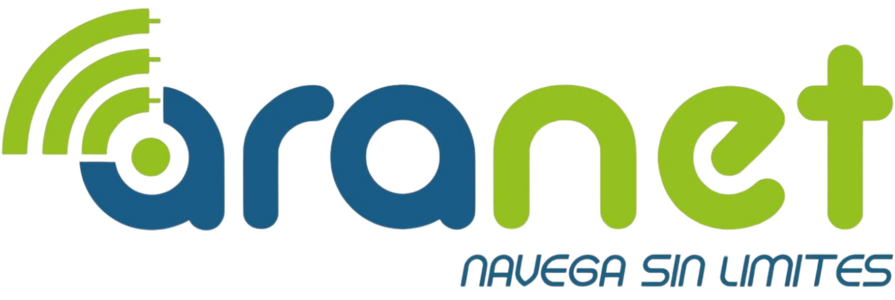

# ARANET

<p align="center">
  
</p>

<p align="center">
  <strong>Tecnología que une, Internet que conecta.</strong><br />
  Fibra óptica para los hogares y negocios de El Pangui, Zamora Chinchipe.
</p>

<p align="center">
  <a href="https://nextjs.org/"></a>
  <a href="https://react.dev/"></a>
  <a href="https://www.typescriptlang.org/"></a>
  <a href="https://tailwindcss.com/"></a>
  <a href="https://vercel.com/"></a>
</p>

<p align="center">
  🌐 <strong>Sitio en producción:</strong> <a href="https://aranet-sigma.vercel.app/">aranet-sigma.vercel.app</a>
</p>

---

Landing oficial de **ARANET**, proveedor de internet de fibra óptica con base en El Pangui, provincia de Zamora Chinchipe, Ecuador.

## Tecnologías

| Categoría | Tecnología | Versión |
|---|---|---|
| Framework | [Next.js](https://nextjs.org/) (App Router + Turbopack) | `16.2.4` |
| UI | [React](https://react.dev/) | `19.2.4` |
| Lenguaje | [TypeScript](https://www.typescriptlang.org/) | `^5` |
| Estilos | [Tailwind CSS](https://tailwindcss.com/) | `^4` |
| Animaciones | [Framer Motion](https://www.framer.com/motion/) | `^12.38.0` |
| Iconos | [Lucide React](https://lucide.dev/) | `^1.8.0` |
| Linting | [ESLint](https://eslint.org/) + `eslint-config-next` | `^9` |
| Fuentes | [Geist](https://vercel.com/font) Sans + Mono (via `next/font`) | — |
| Optimización de imágenes | `next/image` (WebP, lazy loading, `priority`) | — |
| Hosting | [Vercel](https://vercel.com/) (zero-config) | — |

## Contenido del sitio

La landing se organiza en dos rutas:

### `/` — Home

- **Navbar** sticky con logo y enlaces.
- **Hero** — título, CTA, chips de features (fibra óptica, conexión estable, soporte local) e imagen de portada flotante con badge "Desde 150 MB".
- **Planes** — 3 tarjetas (Básico 150 MB, Home 200 MB, Premium 300 MB). El plan destacado tiene borde y sombra verdes.
- **Contacto** — dirección, WhatsApp, redes sociales y mapa embebido de Google Maps de El Pangui.
- **Footer** con redes (Facebook, Instagram, WhatsApp) y documentos legales (PDFs en `public/info/`).

### `/sobre-nosotros`

- **Hero** con gradiente corporativo azul y patrón de puntos verdes.
- **Misión / Visión** con animaciones scroll-triggered.
- **Fundadores**: Alexander Sócola, Alexander Santos y Ronald Torres.
- **Timeline histórica** animada: orígenes universitarios → elección de El Pangui → despliegue de la fibra (marzo 2024) → lanzamiento oficial (11 de abril de 2024).
- **Quote final** con los dos slogans corporativos.

## Marca

- **Azul corporativo:** `#185c88`
- **Verde corporativo:** `#95c11f`
- **Negro texto:** `#1d1d1b`
- **Slogans:** *"Navega sin límites"* · *"Tecnología que une, Internet que conecta"*
- **Logo:** `public/logo/logo.png` (también usado como favicon vía `src/app/icon.png`).

## Desarrollo

Requisitos: Node.js 20+.

```bash
npm install
npm run dev
```

Abre [http://localhost:3000](http://localhost:3000).

## Scripts

- `npm run dev` — servidor de desarrollo (Turbopack)
- `npm run build` — build de producción
- `npm start` — servir el build
- `npm run lint` — ESLint

## Estructura

```
src/
├─ app/
│  ├─ layout.tsx                 # Layout global (Navbar + Footer)
│  ├─ page.tsx                   # Home
│  ├─ sobre-nosotros/page.tsx    # /sobre-nosotros
│  ├─ icon.png                   # Favicon
│  └─ globals.css
└─ components/
   ├─ Navbar.tsx
   ├─ Hero.tsx
   ├─ Plans.tsx · PlanCard.tsx
   ├─ Contact.tsx
   ├─ Footer.tsx
   ├─ AboutHero.tsx
   ├─ MissionVision.tsx          # Client Component (framer-motion)
   ├─ Founders.tsx
   ├─ HistorySection.tsx · HistoryTimeline.tsx
   └─ SlogansQuote.tsx

public/
├─ logo/logo.png                 # Logo oficial
├─ info/*.pdf                    # Documentos legales (Arcotel / Conatel)
├─ mascota/                      # Assets de marca
└─ portada_aranet_*.webp         # Imagen hero del home
```

## Deploy

Desplegado en **Vercel**: [https://aranet-sigma.vercel.app/](https://aranet-sigma.vercel.app/)

El proyecto está listo para desplegarse sin configuración adicional: importar el repositorio desde el dashboard de Vercel y se detecta Next.js automáticamente.

## Contacto

- **Dirección:** Benigno Cruz entre Cordillera del Cóndor y Loja, El Pangui.
- **WhatsApp:** [098 099 2866](https://wa.me/+593980992866)
- **Facebook:** [ARAnetPangui](https://www.facebook.com/ARAnetPangui)
- **Instagram:** [@aranet_pangui](https://www.instagram.com/aranet_pangui/)
- **Web:** [aranet.tech](https://aranet.tech/)
